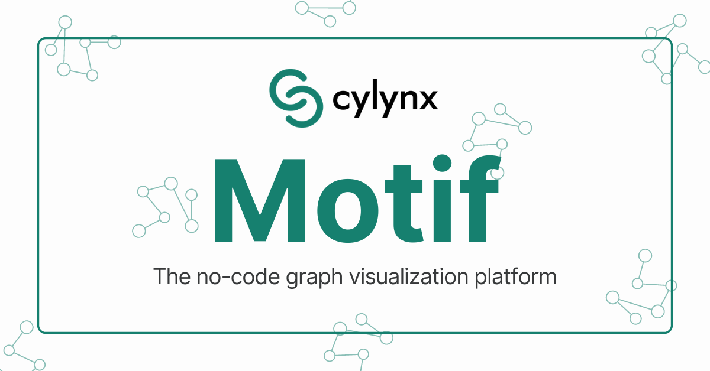
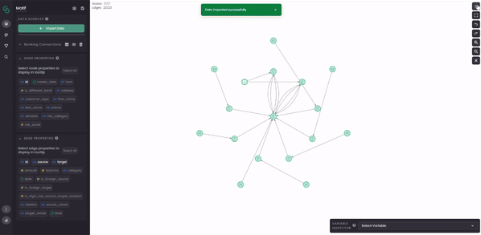

[](https://www.npmjs.com/package/@cylynx/motif) [](https://standardjs.com)



# @cylynx/motif

The no-code graph visualization platform

## Features

- No server required, just a web browser
- No code, visual UI
- Supports multiple graph imports
- Support for rich graph structures, including time series analysis
- Extensible with a widget based component system
- Multiple layout algorithms (force-directed, concentric, grid etc.)
- Multiple node and edge style options
- Multiple import formats (json, csv, neo4j with more to come!)

## Motivation

Motif is an open-sourced graph explorer born from our numerous graph visualisation projects at Cylynx. We hope to make graph exploration, visualisation and discovery quicker and easier.

Inspired by [Kepler.gl](https://github.com/keplergl/kepler.gl) and [Neo4j Bloom](https://neo4j.com/product/bloom/)

## Demo



Try out a full-featured demo with walkthrough at https://demo.cylynx.io

## Roadmap

- Better performance
- Smaller bundle size
- Improve legend support
- Export more components
- More import and export integrations
- Documentation page

## Packages

We use a monorepo approach to maintain our packages

- [@cylynx/motif](https://www.npmjs.com/package/@cylynx/motif), Core Library of Motif
- **motif-demo**, Deployed demo of **@cylynx/motif**
- [@cylynx/pymotif](https://www.npmjs.com/package/@cylynx/pymotif), Jupyter widget bindings for Motif (beta)
- **ui**, playground for ui components

## Getting Started

```bash
$ npm install --save @cylynx/motif
```

### Prerequisites

| Peer Dependencies         | Version    |
| :------------------------ | :--------- |
| `baseui`                  | >= 9.112.0 |
| `react` and `react-dom`   | >= 16.8.0  |
| `styletron-engine-atomic` | >= 1.4.7   |
| `styletron-react`         | >= 5.2.7   |

| Development Environment | Version |
| :---------------------- | :------ |
| `node`                  | >=16    |
| `npm`                   | >=7     |

### Usage

```tsx
import React from 'react';
import { Client as Styletron } from 'styletron-engine-atomic';
import { Provider as StyletronProvider } from 'styletron-react';
import { BaseProvider } from 'baseui';
import Motif, { MotifLightTheme, MotifDarkTheme } from '@cylynx/motif';
import { Provider } from 'react-redux';
import store from './redux-store';
import '@cylynx/motif/dist/motif.css';

const engine = new Styletron();

const App = () => {
  return (
    <StyletronProvider value={engine}>
      <BaseProvider theme={MotifLightTheme}>
        <Provider store={store}>
          <Motif
            name='Motif'
            primaryTheme={MotifLightTheme}
            secondaryTheme={MotifDarkTheme}
            accessors={{
              nodeID: 'id',
              edgeID: 'id',
              edgeSource: 'source',
              edgeTarget: 'target',
            }}
          />
        </Provider>
      </BaseProvider>
    </StyletronProvider>
  );
};

export default App;
```

For more information on the supported graph formats, check out [README.md in packages/motif](./packages/motif/README.md).

## Development

Motif utilise [Lerna](https://github.com/lerna/lerna) to manage multi-package repositories with npm workspaces to ease collaboration and testing.

The library is bundled with [Vite](https://github.com/vitejs/vite).

### Environment Installation

1. Verify Node and NPM version. We use nvm to manage node and npm version - `nvm use 16`.

```bash
$ node -v
v16.1.0

$ npm -v
v7.7.6
```

2. Install the dependencies and link any cross-dependencies in the monorepo.

```bash
$ npm install --legacy-peer-deps
```

**Note**: If you are facing problems installing it might be worth to clear the cache and re-install the dependencies:

```
$ npm cache clean --force
$ npm install --legacy-peer-deps
```

### Develop with Hot-Reloading

We use vite with tsc for development.

**Start development server with preview**

```bash
$ npm run motif
```

**Develop with strict type-checking**

```bash
$ npm run motif:tsc
```

### Production build

**Build and bundling into typescript library**

```bash
$ npm run motif:build
```

**Preview the production bundle**

```bash
$ npm run demo
```

### Testing

**Unit test**

The test runner of **@cylynx/motif** is configure with [Jest](https://jestjs.io/) testing framework. The following commands are use to verify whether the test cases are executed correctly.

```bash
$ cd ./packages/motif
$ npm run test
```

**E2E test**

We use [Cypress](https://www.cypress.io/) testing framework to run e2e tests. This verifies the consistency and accuracy of the library in the client's browser environment. Therefore, several commands and procedure are requires as prequisite to setup the test environment.

1. Perform bundling on the `@cylynx/motif` packages to produce production bundles,

```bash
$ npm run motif:build
```

2. The production bundle produced in **step 1** will be imported by **motif-demo**, and helps to verify the behaviour of the library in the client's browser environment. We will first generate a production build in **motif-demo**.

```bash
$ npm run demo:build
```

3. Serve the demo with port 3000, access `http://localhost:3000` to verify that the application is running.

```bash
$ npm run demo:serve
```

4. Once **step 3** runs successfully, we can launch Cypress to verify whether our test case are running accurately.

```bash
$ cd ./packages/motif && npm run cypress:open
```

## Built with

- Antv G6 and Graphin for the graph library
- Base Web and Styletron for the UI
- Redux for state management
- Typescript

## Contributing

Contributions are always welcome!

See `contributing.md` for ways to get started.

Please adhere to this project's `code of conduct`.

## Commercial Support

We provide commercial support for enterprises using Motif with customised backend integrations and features where necessary.

Contact us at motif@cylynx.io for further information.

## License

MIT © [cylynx](https://github.com/cylynx)
