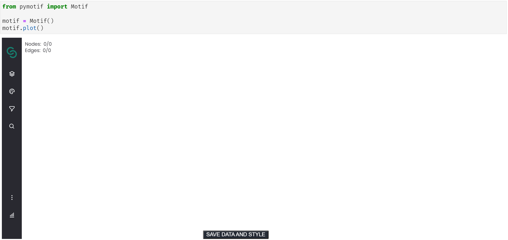

# Pymotif

A Python package that lets you plot Motif graphs within Jupyter Notebook / Jupyter Lab:



It's that easy to get started!

## Advantages

- Seamless integration into existing Jupyter workflows
- Multiple data import options
- Programmatic graph manipulation
- Easy code sharing and reuse

## Installation

You can install using `pip` (we recommend using virtual environments):

```
pip install pymotif
```

And it should work. In some cases, you may also need to install and enable Jupyter extensions:

```
# Jupyter Lab
jupyter labextension install @jupyter-widgets/jupyterlab-manager

# For Jupyter Lab <= 2, you may need to install the extension manually
jupyter labextension install @cylynx/pymotif

# For Jupyter Notebook <= 5.2, you may need to enable nbextensions
jupyter nbextension enable --py [--sys-prefix|--user|--system] pymotif
```

## Examples

Demo notebooks can be found in the `examples` folder. For a start, check out `examples/introduction.ipynb`, which gives a quick overview of the available functionality!

## Motif Class

As shown above, using Motif in Jupyter involves importing and instantiating the `Motif` class from `pymotif`.

### Instantiation

```python
from pymotif import Motif

motif = Motif()
motif.plot()    # or just 'motif'
```

`Motif()` accepts various instantiation parameters (refer to Motif's `__init__` method for updated information):

```
All parameters are optional.
Only one graph import (json_path, nx_graph, neo4j_graph, or csv_path) can be passed each time.

json_path: str
    Path to a local JSON file containing the graph data.
    If this is used, all other params will be ignored.

nx_graph: nx.Graph
    A networkx graph to be rendered

neo4j_graph: neo4j.graph.Graph
    A neo4j graph to be rendered, obtained from the neo4j.Result.graph() method.
    Ref: https://neo4j.com/docs/api/python-driver/current/api.html#graph

csv_path: str
    Path to a local CSV edgelist file

style: dict
    The rendered graph's style. Its format depends on Motif's StyleOptions interface: https://github.com/cylynx/motif.gl/blob/c79ba6549407979a4ec0214cc6c7c7d0f2a3be41/packages/motif/src/redux/graph/types.ts#L206

title: str
    The rendered graph's title
```

e.g. to import a graph from a CSV:

```python
motif = Motif(csv_path=<YOUR CSV PATH>)
```

### Attributes

There is only one class attribute for now:

```
state: dict
    There are 2 possible keys: data, style.
    Data is a list of graph data describing what will be rendered in the widget.
    Style is a dict describing how the graphs will be rendered.

    Follows the TLoadFormat interface defined in Motif's types.ts:
    https://github.com/cylynx/motif.gl/blob/master/packages/motif/src/redux/graph/types.ts#L283
```

e.g.

```python
m = Motif(<YOUR PARAMS>)

# check graph's initial state
m.state

# stuff happens
...

# sanity check
m.state
```

This may be useful for debugging your graph objects at various points in time throughout your analysis.

### Methods

```python
def add_graph(self, **kwargs):
    """
    Adds another graph to an existing Motif widget.
    Takes the same parameters as __init__.
    If provided, graph settings here will overwrite those set previously (e.g. style).
    """


def set_style(self, style: dict, overwrite=False):
    """
    Allows updating the style of an existing widget.

    ------------
     Parameters
    ------------
    style: dict
        The rendered graph's style
    overwrite=False:
        If True, overwrites all existing styles with the passed 'style' param.
        If False, merges 'style' param with existing styles
    """


def plot(self):
    """ Plots the graphs' current state as a Jupyter widget """
```

e.g.

```python
m = Motif(<YOUR PARAMS>)

# add another JSON graph
m.add_graph(json_path=<YOUR JSON PATH>)

# adjust and overwrite the combined graphs' style
m.set_style(style=<YOUR STYLE>, overwrite=True)

# plot the combined graph
m.plot()
```

---

## Development

This section contains instructions for developing Pymotif locally.

For a more thorough walkthrough check out the official Jupyter widgets guide:  
https://ipywidgets.readthedocs.io/en/latest/examples/Widget%20Custom.html

### Create a new conda environment with the dependencies

To create the environment, execute the following command:

```
conda create -n motif -c conda-forge jupyterlab nodejs python
```

Then activate the environment with:

```
conda activate motif
```

### Build and install the widget for development

Since the widget contains a Python part, you need to install the package in editable mode:

```
npm run pymotif:build // In root directory to link it with monorepo setup
python -m pip install -e .
```

Install required Python packages:

```
python -m pip install -r requirements.txt
```

If you are using JupyterLab:

```
jupyter labextension develop --overwrite .
```

If you are using the Classic Notebook:

```
jupyter nbextension install --sys-prefix --symlink --overwrite --py pymotif
jupyter nbextension enable --sys-prefix --py pymotif
```

To continuously monitor the project for changes and automatically trigger a rebuild, start Jupyter in watch mode:

```
jupyter lab --watch
```

And in a separate session, begin watching the source directory for changes:

```
npm run pymotif  // In root directory to link it with monorepo setup
```

After a change wait for the build to finish and then refresh your browser and the changes should take effect.

If you make a change to the python code then you will need to restart the notebook kernel to have it take effect.

### Publishing

1. Update the version in package.json
2. Relase the `@cylynx/pymotif` packages:

```
npm login
npm run pymotif:publish
```

3. Bundle the python package: `python setup.py sdist bdist_wheel`
4. Update the version in `pymotif/_version.py`
5. If frontend version dependency has changed, update `pymotif/_frontend.py`
6. Publish the package to PyPI:

```
pip install twine
twine upload dist/pymotif*
```
